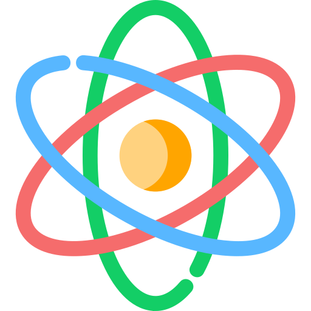
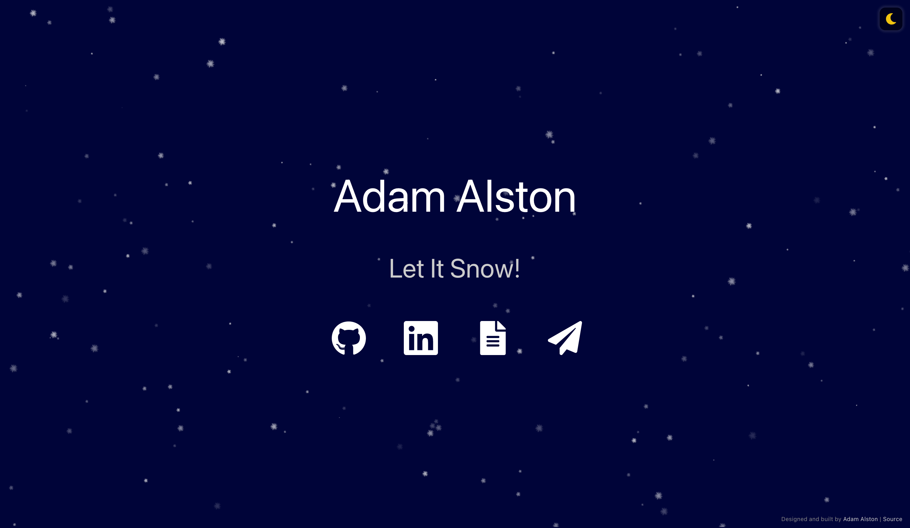

#  adamalston.com &middot;  

The second iteration of [adamalston.com](https://www.adamalston.com) built with [React](https://reactjs.org/) and hosted with [Netlify](https://www.netlify.com/).

Previous iteration: [v1](https://github.com/adamalston/v1)

 

This website's design is both simple and accessible. Dynamic particles create an experience that is interactive and visually inviting. The site offers two themes via a toggle, dark mode (default) and light mode. Once toggled, the selected theme should persist between tabs, windows, and page reloads. 

Mobile support for the site ranges from 4 in. displays through 6.7 in. all the way up to 13 in. tablets.

##  Open Source

I made this website open source under the assumption that others would use the code to create their own websites. I only ask that this code be used with attribution as a significant amount of time has been spent writing and optimizing it. Please give proper credit by linking back to [adamalston.com](https://www.adamalston.com/). Thanks!

    
<b>Installation and Setup</b>

1. Clone this repository
2. Install packages/dependencies: `npm install`
3. Start the development server: `npm start`
4. Feel free to change anything like icons or particle colors

**Building and Deployment**

1. Create a production build of the website: `npm run build`
2. Deployment: The [React/Deployment](https://create-react-app.dev/docs/deployment/) docs detail how to deploy to `gh-pages`, Netlify, and many other services

##  Icons

Font Awesome icons

| Use        |                      Icon                      | Short-Code        |
| ---------- | :--------------------------------------------: | ----------------- |
| Dark Mode  |  | `fas moon`        |
| Light Mode |  | `fas sun`         |
| GitHub     |  | `fab github`      |
| LinkedIn   |  | `fab linkedin`    |
| Resume     |  | `fas file-alt`    |
| Email      |  | `fas paper-plane` |

##  Color Reference

Text and icons meet a color contrast ratio of 7:1 against the background of the website, conforming with [WCAG 2.1](https://www.w3.org/TR/WCAG21/) Section 1.4.6

| Name   |                          Color                          | Hex      |
| ------ | :-----------------------------------------------------: | -------- |
| Black  |  | `000000` |
| Slate  |  | `333333` |
| Purple |  | `C912ED` |
| Blue   |  | `00BFFF` |
| Green  |  | `22DD22` |
| Gold   |  | `FFD500` |
| Orange |  | `FF8000` |
| Red    |  | `FF2600` |
| Silver |  | `CCCCCC` |
| White  |  | `FFFFFF` |

---

If you found this project useful, please consider giving it a ! If you have any questions or feedback, open an issue and I will get back to you :&#8203;)
