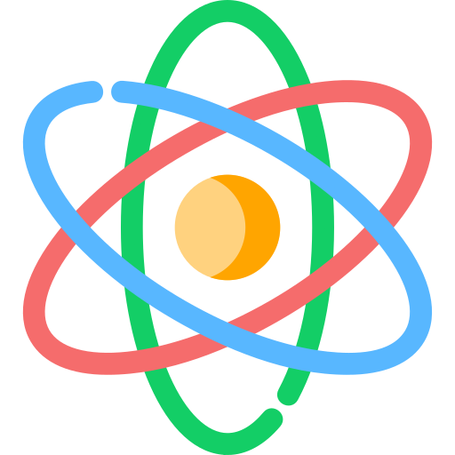
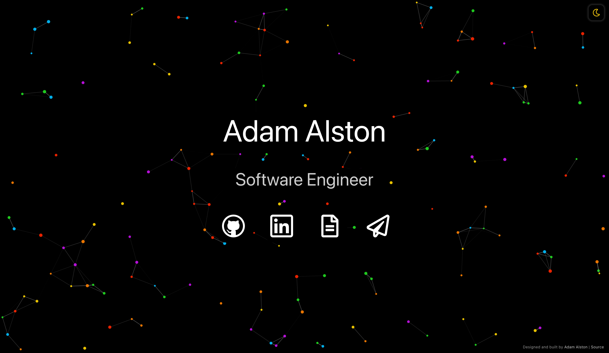
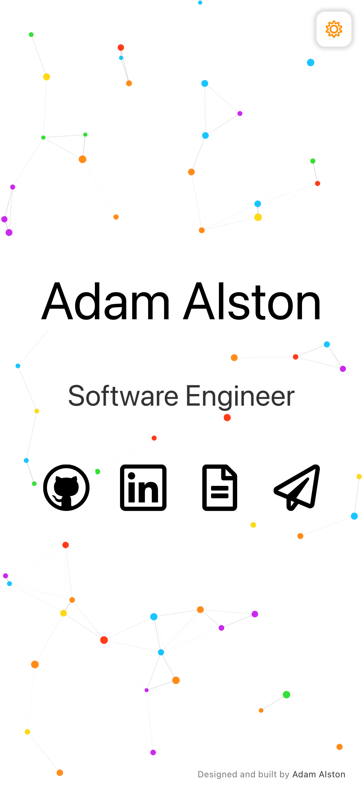

<div align="center">
  
</div>
<h1 align="center">adamalston.com - v2</h1>

[adamalston.com](https://www.adamalston.com) is built using [React](https://react.dev).

 

This website is designed to be simple and accessible. Dynamic particles create an interactive experience for visitors. The site offers two themes via a toggle: a dark theme (default) and a light theme. The selected theme persists across tabs, windows, and page reloads.

## Open source

This website is open source with the hope that others will use the code to create their own websites. I ask that this code be used with attribution, as a significant amount of time was spent on writing and optimizing it. Please give proper credit by linking back to [adamalston.com](https://www.adamalston.com). Thank you!

## Set up

> [!IMPORTANT]
> This project requires [Node.js](https://nodejs.org/) to run.

1. Clone this repository:
   ```sh
   git clone https://github.com/adamalston/v2.git
   ```
2. Navigate into the project directory:
   ```sh
   cd v2
   ```
3. Install dependencies:
   ```sh
   npm install
   ```
4. Start the app in development mode:
   ```sh
   npm start
   ```

<details>
  <summary>Build and deploy</summary>

1. Create a production build:
   ```sh
   npm run build
   ```
2. Refer to the [React Deployment](https://create-react-app.dev/docs/deployment) docs to deploy to platforms like GitHub Pages, Netlify, or Vercel.

</details>

## Icons

The website uses Font Awesome icons for various interactive elements.

| Use        | Icon                                                         | Short-Code        |
| ---------- | ------------------------------------------------------------ | ----------------- |
| Dark Mode  |      | `far moon`        |
| Light Mode |       | `far sun`         |
| GitHub     |    | `fab github`      |
| LinkedIn   |  | `fab linkedin`    |
| Resume     |      | `fal file-alt`    |
| Email      |     | `fal paper-plane` |

## Color reference

Text and icons are designed with a color contrast ratio greater than 7:1, satisfying [WCAG 2.1 Section 1.4.6](https://www.w3.org/TR/WCAG21/#contrast-enhanced).

| Name   | Color                                              | Hex       |
| ------ | -------------------------------------------------- | --------- |
| Black  |   | `#000000` |
| Slate  |   | `#333333` |
| Red    |     | `#ff2600` |
| Orange |  | `#ff8000` |
| Yellow |  | `#ffd500` |
| Green  |   | `#22dd22` |
| Blue   |    | `#00bfff` |
| Purple |  | `#c912ed` |
| Silver |  | `#cccccc` |
| White  |   | `#ffffff` |

## Previous version

For a look at the first version of my website and to see how it has evolved, visit [v1](https://github.com/adamalston/v1).

---

If you find this project useful, consider giving it a ! Have a question or feedback? Open an issue or send me an email. I'll respond as soon as possible.
