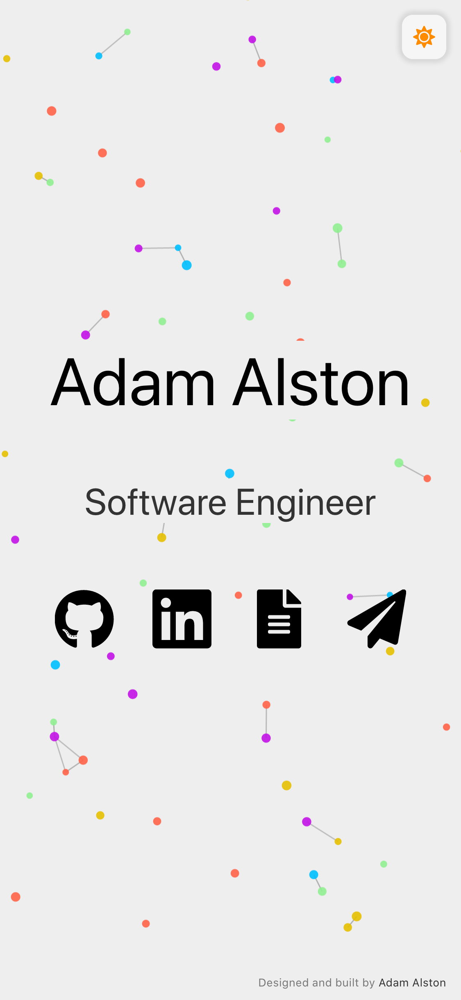

# adamalston.com &middot;  

The second iteration of [adamalston.com](https://www.adamalston.com) built with [React](https://reactjs.org/) and hosted with [Netlify](https://www.netlify.com/).

Previous iteration: [v1](https://github.com/adamalston/v1)

 

This website is designed to be simple and accessible. The dynamic particles make it both interactive and visually inviting. The website defaults to dark mode and can be toggled to light mode. Once toggled, the theme should persist between tabs, windows, and page reloads.

## :key: Open Source

I made this website open source under the assumption that others would use the code to create their own websites. I only ask that you use this code with attribution as I have spent a significant amount of time writing it.

If you use this code, please give me proper credit by linking back to [adamalston.com](https://www.adamalston.com/). Thanks!

##  Icons

[Font Awesome](https://fontawesome.com/) icons

| Use        | Icon                                                             |
| ---------- | ---------------------------------------------------------------- |
| Dark Mode  |  `['far', 'moon']`               |
| Light Mode |  `['far', 'sun']`                 |
| GitHub     |  `['fab', 'github']`           |
| LinkedIn   |  `['fab', 'linkedin'`        |
| Resume     |  `['fas', 'file-alt']`           |
| Email      |  `['fas', 'paper-plane']` |

## :art: Color Reference

Text and icons meet a color contrast ratio of 4.5:1 against the background of the website, conforming with [WCAG 2.1](https://www.w3.org/TR/WCAG21/) Section 1.4.3.

| Color       | Hex                                                                |
| ----------- | ------------------------------------------------------------------ |
| Black       |  `#000000` |
| Purple      |  `#C311E7` |
| Turquoise   |  `#4DC9FF` |
| Light Green |  `#90EE90` |
| Gold        |  `#FFD300` |
| Light Red   |  `#FF6961` |
| Silver      |  `#BBBBBB` |
| Light Gray  |  `#EEEEEE` |

Particle colors can be changed in [`src/components/Particles.jsx`](src/components/Particles.jsx#L14).

---

If you have any questions or feedback, open an issue and I will get back to you :&#8203;)
