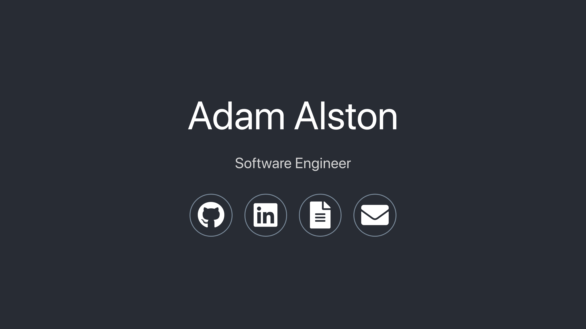

<h1 align="center">
	adamalston.com
</h1>

	

The second iteration of [adamalston.com](https://www.adamalston.com/) built with [React](https://reactjs.org/) and hosted with [Netlify](https://www.netlify.com/).

Previous iteration: [v1](https://github.com/adamalston/v1)

---

	

This website is built to be simple, lean, and accessible. The background is designed with the [`particles.js`](https://github.com/VincentGarreau/particles.js/) library for creating particles. My intention is for the website to be both interactive and inviting. Large are used to enhance readability.

---

## <i class="fa fa-cog fa-spin"></i> Icons

[<i class="far fa-flag fa-fw"></i> Font Awesome](https://fontawesome.com/) icons

<link rel="stylesheet" href="https://use.fontawesome.com/releases/v5.6.1/css/all.css" integrity="sha384-gfdkjb5BdAXd+lj+gudLWI+BXq4IuLW5IT+brZEZsLFm++aCMlF1V92rMkPaX4PP" crossorigin="anonymous">

| Name     | Icon                                                                                              |
| -------- | ------------------------------------------------------------------------------------------------- |
| GitHub   | <i class="fab fa-github fa-3x fa-fw" style="vertical-align: middle;"></i> `['fal', 'github']`     |
| LinkedIn | <i class="fab fa-linkedin fa-3x fa-fw" style="vertical-align: middle;"></i> `['fab', 'linkedin'`  |
| Resume   | <i class="fas fa-file-alt fa-3x fa-fw" style="vertical-align: middle;"></i> `['fas', 'file-alt']` |
| Email    | <i class="fas fa-envelope fa-3x fa-fw" style="vertical-align: middle;"></i> `['fas', 'envelope']` |

## 🎨 Color Reference

Colors meet a color contrast ratio of 4.5:1 against the background of the website, conforming with [WCAG 2.0](https://www.w3.org/TR/WCAG20/) Section 1.4.3.

| Color       | Hex                                                                |
| ----------- | ------------------------------------------------------------------ |
| White       |  `#ffffff` |
| Purple      |  `#c311e7` |
| Light Green |  `#b8e986` |
| Turquoise   |  `#4dc9ff` |
| Gold        |  `#ffd300` |
| Light Red   |  `#FF7E79` |
| Black       |  `#000000` |
