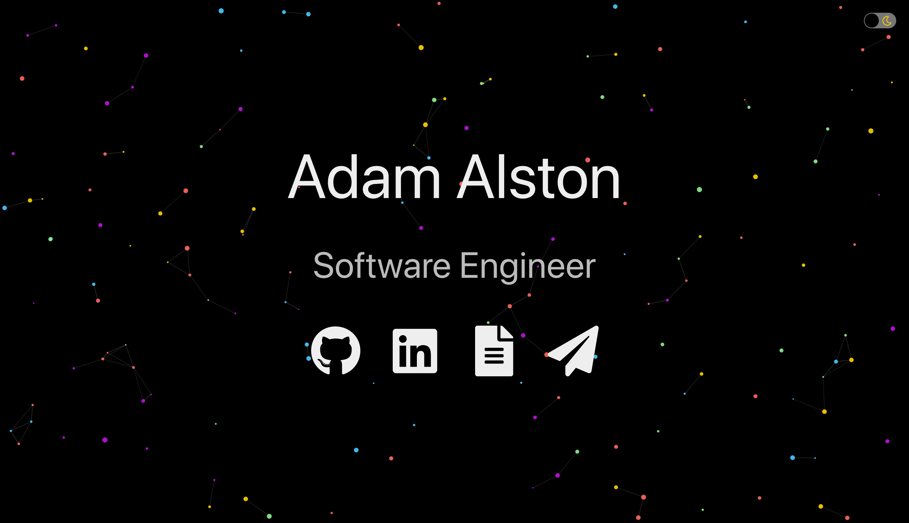

<h1 align="left">adamalston.com 
    &middot;
    
    
</h1>

 The second iteration of 
    <a href="https://www.adamalston.com" role="link" aria-label="visit my website">adamalston.com</a> built with 
    <a href="https://reactjs.org/" role="link" aria-label="visit the React website to learn more about the javascript library">React</a> and hosted with 
    <a href="https://www.netlify.com/" role="link" aria-label="visit the Netlify website to learn more about the host service">Netlify</a>.

Previous iteration: 
    <a href="https://github.com/adamalston/v1" role="link" aria-label="visit the repository for the previous iteration of my website to learn more">v1</a>

    

This website is built to be simple and accessible. The `Particles.js` library creates dynamic particles making the website both interactive and visually inviting. Large fonts are used to enhance readability.

##  Icons

<a href="https://fontawesome.com/" role="link" aria-label="visit the Font Awesome website to learn more about the icon library">Font Awesome</a> icons

| Use      | Icon                                                                                                                                                                                       |
| -------- | ------------------------------------------------------------------------------------------------------------------------------------------------------------------------------------------ |
| GitHub   |  `['fab', 'github']`                   |
| LinkedIn |  `['fab', 'linkedin'`            |
| Resume   |  `['fas', 'file-alt']`                 |
| Email    |  `['fas', 'paper-plane']` |

## 🎨 Color Reference

Colors meet a color contrast ratio of 4.5:1 against the background of the website, conforming with <a href="https://www.w3.org/TR/WCAG20/" role="link" aria-label="visit the Web Content Accessibility Guidelines 2.0 website to learn more about the accessibility standard">WCAG 2.0</a> Section 1.4.3.

| Color       | Hex                                                                |
| ----------- | ------------------------------------------------------------------ |
| Light Gray  |  `#eeeeee` |
| Silver      |  `#bbbbbb` |
| Light Red   |  `#ff7e79` |
| Gold        |  `#ffd300` |
| Light Green |  `#b8e986` |
| Turquoise   |  `#4dc9ff` |
| Purple      |  `#c311e7` |
| Dark Gray   |  `#333333` |
